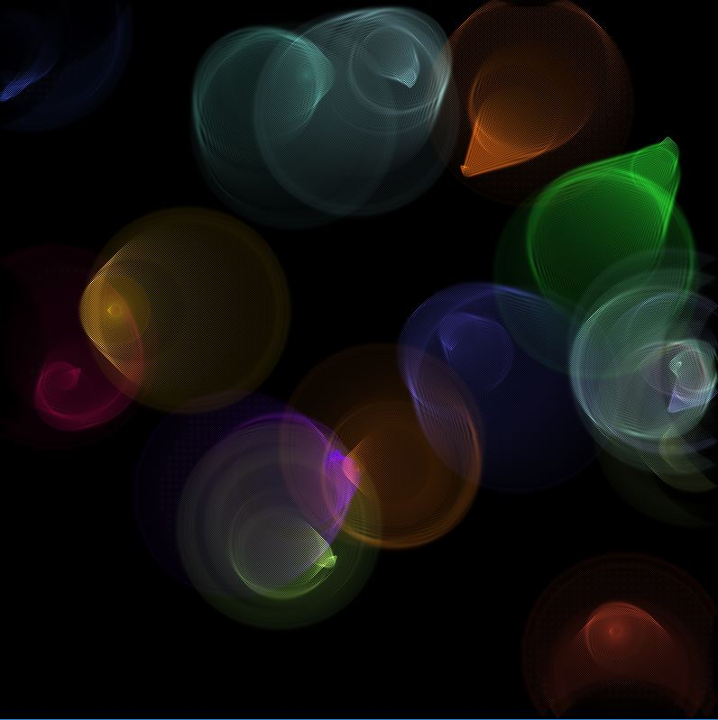

# be-water-my-friend
Coding challenge #102
With colors, entities that move randomly and usage of OpenMP with 3 threads to speed up the process.
The code isn't that gud tho, reading it feels like using C but with the advantages of the C++ standard library. I'm lazy to do more.

# Dependencies
* Get g++, any c++ distribution should be good to run this code
* Install SDL1.2-dev

# Run
* make re && ./water

# Side note
I've tested it on windows, so the build was done on windows ubuntu bash (it should compile on linux then) and I used a windows server X to get the graphical results.

If you do test it my way you should set this env variable `export DISPLAY=localhost:0.0`

This coding challenge comes from [The Coding Train](https://www.youtube.com/user/shiffman/featured) youtube channel.

I implemented the following algorithm [2D Water](https://web.archive.org/web/20160418004149/http://freespace.virgin.net/hugo.elias/graphics/x_water.htm) as referenced by Daniel Shiffman in his youtube channel The Coding Train.

# Results

